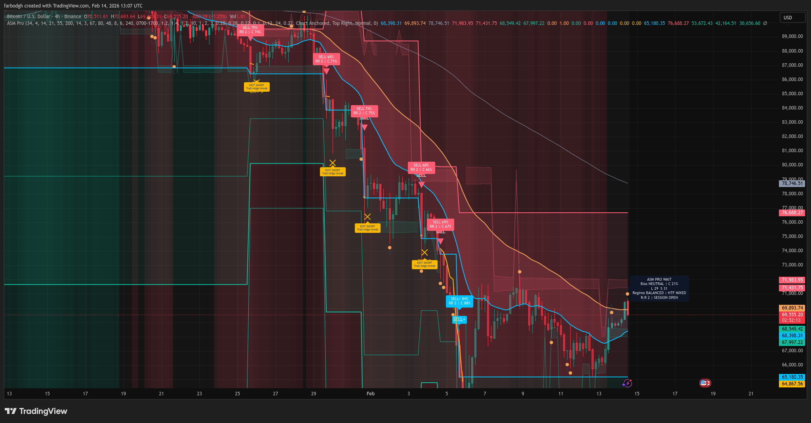

# Apex Signal Matrix Pro (ASM Pro)

Apex Signal Matrix Pro is a multi-factor, non-repainting trade decision indicator for intraday and swing trading.
It combines trend, momentum, structure, participation, and risk/reward scoring into one directional engine and visual trade map.

## What It Does

ASM Pro answers five core questions on every bar:

1. Is the market directional enough to trade?
2. Which side currently has the stronger edge (long or short)?
3. Is momentum aligned with structure and participation?
4. Is the setup quality high enough to trigger a signal?
5. Are the mapped stop/targets and R:R acceptable?

## Core Features

- Composite long/short score engine (0-100 per side).
- Confidence score based on score strength and directional spread.
- Higher-timeframe alignment filter (optional).
- Chop-avoidance filter using ADX + efficiency + volatility compression context.
- Session filter (optional) for market-hour discipline.
- Liquidity sweep markers (failed breaks that close back inside range).
- Break-of-structure integration in the structure score.
- Demand/supply zone detection from pivot clustering.
- Signal cooldown to reduce clustering/spam.
- Strong-signal tier for high-conviction entries.
- Trade map with Entry, Stop, TP1, TP2, TP3, and adaptive trailing level.
- Exit signals when edge deteriorates or protective levels are hit.
- Dashboard with bias, scores, confidence, regime, HTF state, R:R, and map state.
- Alert conditions for entries, strong signals, exits, and sweeps.

## How Signals Are Built

ASM Pro computes directional scores from five weighted components:

1. Trend component
- EMA stack quality (fast/mid/slow ordering).
- Price location vs fast EMA.
- ADX strength.
- EMA slope and compression behavior.

2. Momentum component
- RSI state.
- MACD histogram z-score.
- Short-term rate of change.
- Candle body pressure.
- CVD-style directional participation proxy.

3. Structure component
- Distance to nearby demand/supply clusters.
- Available room to opposing zone.
- Break-of-structure event bonus.
- Liquidity sweep event bonus.

4. Participation component
- Relative volume quality (or neutral fallback when volume is not reliable).

5. Risk/Reward component
- ATR + structure-aware stop candidate.
- Multi-target projection from R-multiples.
- R:R quality scoring and minimum R:R enforcement.

Final long/short scores are smoothed and compared. Bias is long/short only if the score spread exceeds the configured `Bias Edge`.

## Signal Logic

A long signal requires:

- Long score above `Entry Threshold`.
- Long bias confirmed by score spread.
- Trend and momentum minimum quality checks.
- Minimum R:R check.
- All active filters passing (HTF/session/chop as configured).
- Cooldown complete.
- Threshold cross or strong acceleration event.

Short signals mirror the same logic.

Strong signals (`LONG+`, `SHORT+`) require higher score/confidence and are visually distinct.

## Exit Logic

Exit fires for active-side setups when any of the following occurs:

- Price hits mapped stop.
- Price violates adaptive trailing level.
- Active-side score degrades below `Exit Threshold`.
- Opposing side overtakes with clear score advantage.

## Visual Guide

- Triangle up/down: standard long/short entry.
- Label up/down (`LONG+` / `SHORT+`): strong entry.
- `S` circle markers: liquidity sweeps.
- `EXIT L` / `EXIT S`: exit conditions met.
- EMA ribbon: trend context.
- Demand/Supply bands: structural zones from pivot clustering.
- Trade map lines:
  - Entry (cyan)
  - Stop (red)
  - TP1/TP2/TP3 (green tiers)
  - Adaptive trail (gold)

## Dashboard Fields

- `Bias`: Current directional dominance.
- `Long Score` / `Short Score`: Composite side quality.
- `Confidence`: Overall conviction.
- `Regime`: Trend / Chop / Balanced.
- `HTF`: Higher-timeframe state (Bull/Bear/Mixed).
- `R:R`: Current mapped reward-to-risk quality.
- `Session`: Whether the active session filter is open.
- `State`: Current signal state.
- `Map`: Active or locked trade map side.
- `Bars Since`: Bars from latest mapped signal.
- `Trail`: Current adaptive trailing level.

## Recommended Setup Workflow

1. Add indicator to chart.
2. Keep defaults for first run.
3. Choose higher timeframe for context (commonly 3x to 6x chart timeframe).
4. Enable session filter if you trade specific market windows.
5. Set `Minimum R:R` to your risk policy.
6. Only take entries aligned with both bias and your discretionary context.
7. Use mapped stop/targets and trail level for risk control.

## Tuning Tips

- More selective signals:
  - Increase `Entry Threshold`.
  - Increase `Bias Edge`.
  - Increase `Minimum R:R`.
  - Keep `Avoid Choppy Regime` enabled.

- More frequent signals:
  - Lower `Entry Threshold` slightly.
  - Lower `Bias Edge` slightly.
  - Reduce `Signal Cooldown`.

- Faster reaction:
  - Reduce `Score Smoothing`.

- Stronger trend bias:
  - Increase trend weight.
  - Keep HTF filter enabled.

## Non-Repainting Notes

- Entry/exit conditions are evaluated on confirmed bars.
- Higher-timeframe filters use confirmed higher-timeframe values.
- No lookahead is used in MTF requests.

## Alerts

Available alert conditions:

- ASM Long Entry
- ASM Short Entry
- ASM Strong Signal
- ASM Exit
- ASM Liquidity Sweep

Create alerts directly from the indicator’s alert conditions and choose once-per-bar-close for consistency.

## Risk Notice

This tool provides technical signal and structure guidance, not certainty. Use position sizing, hard risk limits, and execution discipline.
